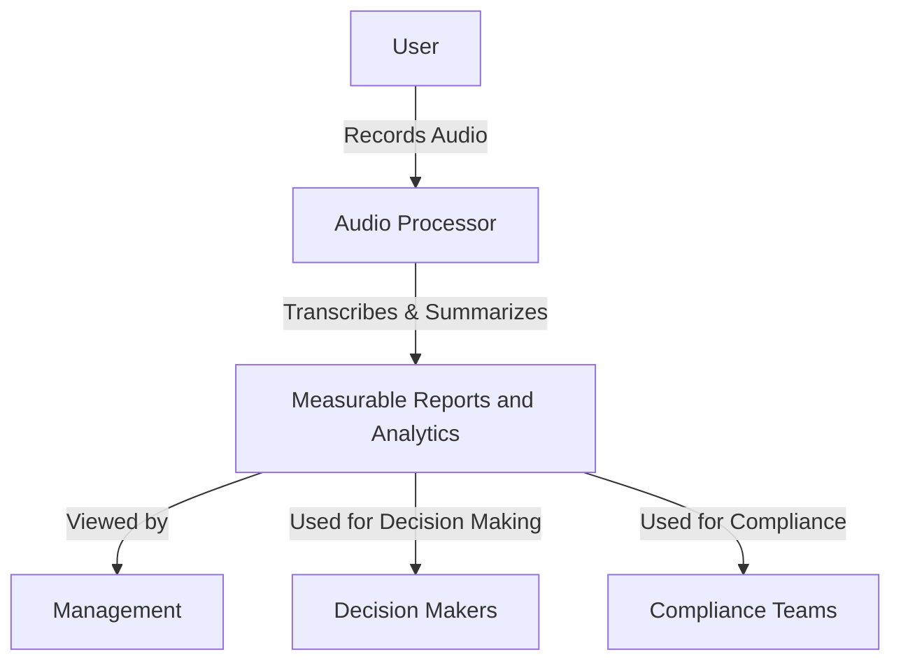
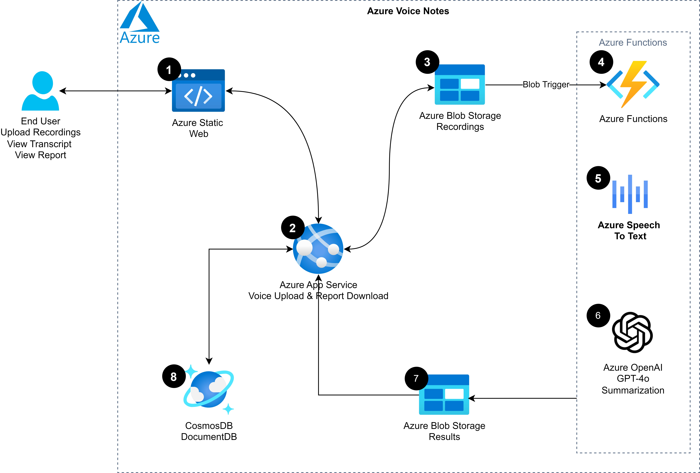
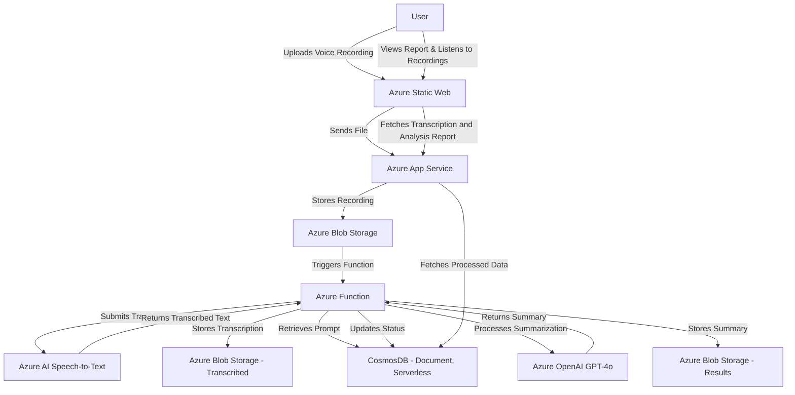
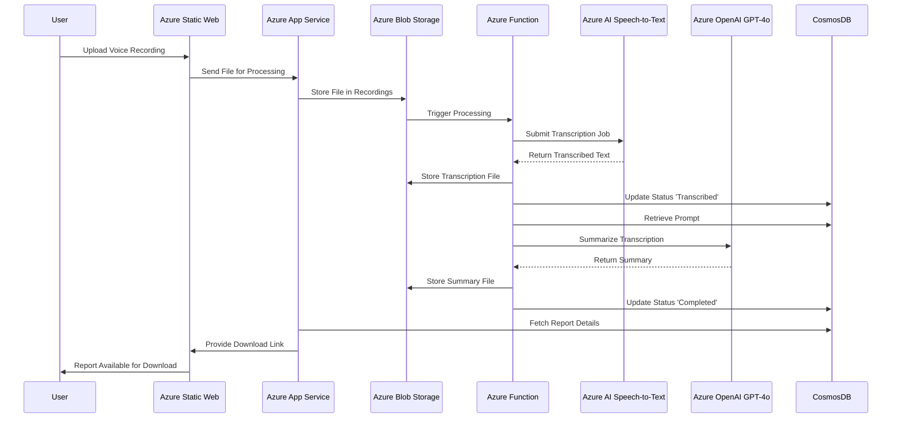

# Sonic Brief Project
> [!WARNING]
> This Solutions Accelerator is in early stages and is subjected to changes.

## Table of Contents
1. [Overview](#overview)
   - [Project Description](#project-description)
   - [Problem Background](#problem-background)
   - [Use Cases](#use-cases)
2. [High-Level Architecture](#high-level-architecture)
3. [Architecture](#architecture)
4. [Components](#components)
5. [Workflows](#workflows)
6. [Prerequisites](#prerequisites)
7. [Programming and Tools Used](#programming-and-tools-used)
8. [Technologies](#technologies)
9. [Usage Instructions](#usage-instructions)

## Overview

### Project Description
Azure Voice Notes is a cloud-based audio processing system that allows users to efficiently process voice recordings by transcribing them into text and generating summarized reports. It provides an end-to-end workflow from audio input to structured reports.

### Problem Background
From our research, many organizations reported that their internal resources waste around **70% of their time** transcribing and summarizing their audio use cases. Some organizations stated that they cannot process all of their internal audio due to **limited capacity and high costs**. For example, call centers struggle with the operational headache and expenses of manually transcribing and summarizing conversations.

To address these pain points, this project provides an automated solution to streamline transcription, summarization, and structured report generation. It allows organizations to customize their workflows and significantly **reduce time and costs** while transforming unstructured audio inputs into structured, measurable data. It transforms unstructured voice inputs into measurable, structured outputs, improving efficiency and accessibility of voice data analysis.

### Use Cases

- **Medical Summarization for Appointments** 🏥: Transcribe and summarize doctor-patient conversations to create structured medical notes.
- **Social Workers Summarization for Appointments** 🏠: Convert case discussions into structured reports for better case tracking and management.
- **Call Center QA for Summarization and Analysis** 📞: Analyze customer support interactions, extract insights, and generate quality assurance reports.
- **Legal Documentation**  ⚖️:: Transcribe legal proceedings and meetings into structured, searchable documents.
- **Academic Research and Interviews** 🎓: Automatically convert research interviews into summarized reports for easier analysis.
- **Business Meetings & Conference Calls** 💼: Generate structured summaries from meeting recordings to improve collaboration and documentation.

## High-Level Architecture
This system leverages various **Microsoft Azure** tools for processing and storage, including:

- **Azure Static Web Apps**: Provides a web interface for user interaction.
- **Azure App Service**: Handles backend logic for user management, file handling, and workflow execution.
- **Azure Blob Storage**: Stores audio recordings, transcriptions, and reports.
- **Azure Functions**: Processes voice recordings asynchronously, handling transcription and summarization tasks.
- **Azure Speech-to-Text API**: Converts audio into structured text.
- **Azure OpenAI GPT-4o**: Summarizes transcriptions and refines text output.
- **CosmosDB (Document, Serverless)**: Manages metadata, logs, and user records.
> [!Note]
> The architecture separates components and follows an asynchronous model to ensure scalability and a balanced cost structure. It ensures seamless integration between various Azure components, facilitating automated transcription, summarization, and report generation. The system leverages Microsoft Azure services, including Azure Static Web, Azure App Service, Azure Cosmos DB, Azure Functions, Blob Storage, Speech-to-Text, and OpenAI GPT-4o for summarization.
### Architecture Diagram

The system consists of multiple components working together:

1. **Azure Static Web** - This is a React app that provides a web interface where end users can upload voice recordings, view transcripts, and access reports. The UI allows the user to view the transcription and PDF analysis report by retrieving this information from the database. It allows the user to add prompts and customize the prompt for the report summarization. It also includes login and register functionality and interacts with Azure App Service as a backend.
2. **Azure App Service** - This is the backend service written using FastAPI and mainly interacts with CosmosDB, the frontend, and Azure Blob Storage to upload files, register users, login, and retrieve data from the database.
3. **Azure Blob Storage (Recordings)** - Stores uploaded voice recordings.
4. **Azure Functions** - This function is written in Python and triggers based on Azure Blob Storage triggers for every new recording upload. It runs asynchronously for each new blob recording upload. The function handles transcription, uploads transcriptions, updates the database, and summarizes the text using GPT-4o while fetching prompts from the database.
5. **Azure Speech-to-Text** - Converts voice recordings into text.
6. **Azure OpenAI GPT-4o** - Summarizes the transcribed text.
7. **Azure Blob Storage (Results)** - Stores processed transcripts and summarized reports.
8. **CosmosDB (Document, Serverless)** - Stores metadata, logs, and user activity for analytics and tracking.

## Workflow

1. **User Uploads Recording**: The end user uploads a voice recording via the **Azure Static Web** interface.

2. **File Storage & Processing Trigger**: The **Azure App Service** stores the recording in **Azure Blob Storage (Recordings)**, triggering an **Azure Function**.

3. **Azure Functions: Transcription and Summarization Processing**:

   - **Getting file from Azure Blob from the trigger**
   - **Transcription Process**:
     - The function submits the transcription job to Azure AI Speech "Speech to Text" and updates the database with the status 'transcribing'.
     - It waits and checks the transcription status until completion.
     - If successful, the transcribed text file is uploaded to Azure Blob Storage (transcribe.txt).
     - The database is updated with the status 'transcribed', and the Blob URL is stored.
   - **Prompt Retrieval & Summarization**:
     - The function retrieves the relevant prompt based on the job category and sub-category ID from the database.
     - The transcribed text is sent to **Azure OpenAI GPT-4o**, which generates a concise summary.
   - **Report Storage & Completion Update**:
     - The summarized report is stored in **Azure Blob Storage (Results)**.
     - The function updates the database with the status 'completed' and stores the analysis report file Blob URL.

4. **Report Retrieval**:

   - The **Azure App Service** retrieves the processed data from the database.
   - The UI fetches and displays the transcription and analysis report.
   - The user can listen to the recordings and view job details.
   - The user can download the final report.

5. **Logging & Analytics**: Logging and metadata are stored in **CosmosDB (Document, Serverless)** for tracking and analytics.

## Prerequisites

To deploy and run this project, you need:

- **Microsoft Azure Account** with access to the following services:
  - Azure Static Web Apps
  - Azure App Service
  - Azure Blob Storage
  - Azure Functions
  - Azure Speech-to-Text API
  - Azure OpenAI GPT-4o API
  - CosmosDB (Document, Serverless)
- **Node.js** (for frontend development, if applicable)
- **Python** (backend implementation)

## Deployment Options

There are two types of deployment guidance available for the Azure AI Transcription Accelerator solution:

### Manual Deployment

This option guides you through deploying all required resources step-by-step via the Azure Portal. Detailed instructions are available in the [manual deployment documentation](/manual-deployment/README.md).

### Automatic Deployment Using Terraform

For an automated approach, use Terraform to deploy all necessary resources. The complete Terraform configuration and instructions are provided in the [Terraform deployment documentation](infra/README.md).

## Technologies Used

- **Frontend**: Azure Static Web Apps
- **Backend**: Azure App Service, Azure Functions
- **Storage**: Azure Blob Storage
- **AI Processing**:
  - Azure Speech-to-Text
  - Azure OpenAI GPT-4o
- **Database**: CosmosDB (Document, Serverless)
---

### 📌 **Contributors**  

We appreciate the efforts and contributions of the following individuals:

| Name                 | LinkedIn |
|----------------------|-----------------|
| **Moustafa Mahmoud** | [MoustafaAMahmoud](https://www.linkedin.com/in/moustafaamahmoud/)   |
| **Wolfgang Knupp**   | [WolfgangKnupp](https://www.linkedin.com/in/wolfgangknupp/)               |

> [!Note]
> Special thanks to Chris Masuda, David Willis, and Joe Broughton from Leicestershire County Council for preparing the manual deployment guidance.
> Special thanks to Simon Harris from Shared Regulatory Services (SRS) for helping with testing and sharing ideas to enhance the solution.

If you’ve contributed, feel free to submit a PR! 🚀  
