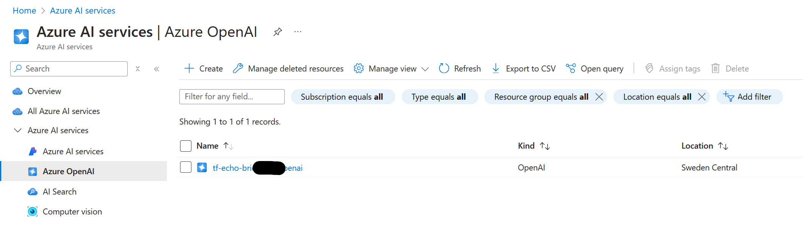
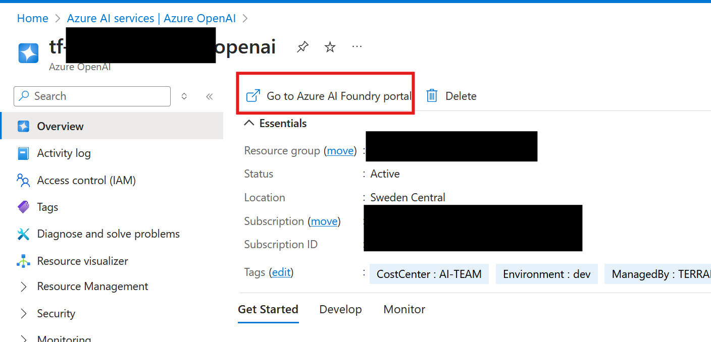
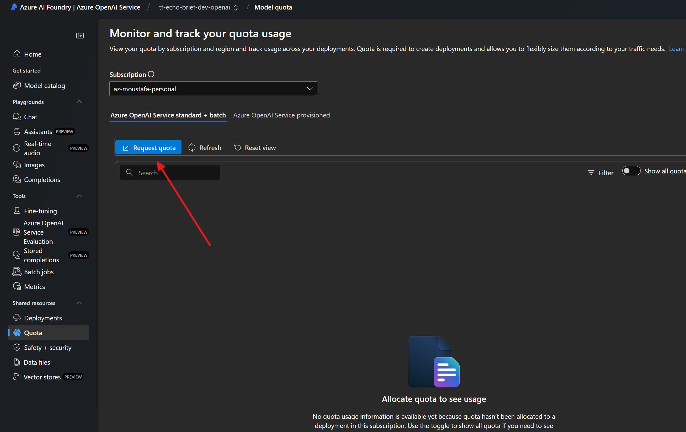
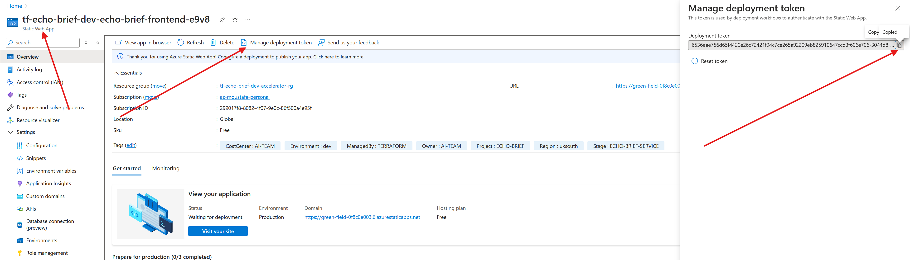
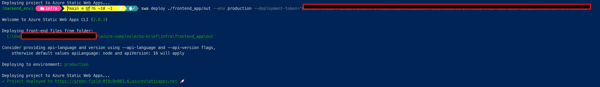
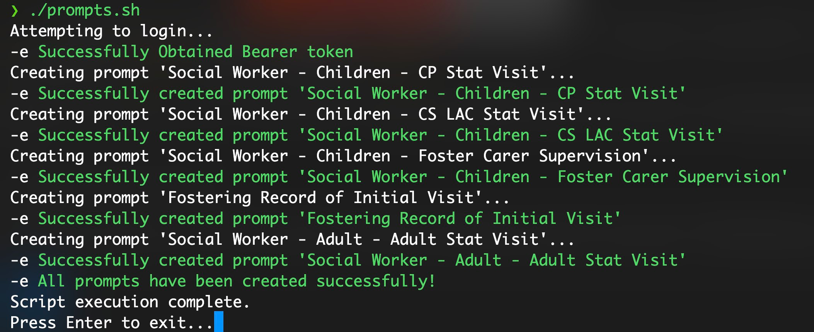

# Azure Solution Deployment Using Terraform

## Table of Contents
- [Overview](#overview)
- [Prerequisites](#prerequisites)
- [Forking the Repository](#forking-the-repository)
- [Terraform State Management](#terraform-state-management)
- [Resource Components](#resource-components)
- [Deployment Steps](#deployment-steps)
- [Understanding the Terraform Configuration Files](#understanding-the-terraform-configuration-files)
- [Testing and Validation](#testing-and-validation)
- [Troubleshooting](#troubleshooting)
- [Clear Deployment](#clear-deployment)

## Overview
This repository contains Terraform code to deploy an Azure-based Echo Brief solution, which includes various Azure services configured to work together seamlessly.

## Prerequisites
Before you start, ensure you have:
- [Terraform](https://www.terraform.io/downloads.html) installed locally
- Access to an Azure subscription
- Azure CLI installed and configured
- A GitHub account (if you plan to fork the repository)

## Create Terrafom Storage Account

### Login to Azure (if not already logged in)
az login

### Create the resource group named 'terraform'
az group create --name terraform --location eastus


#### UNCOMMENT FOR WINDOWS:
$RANDOM_SUFFIX = [System.Guid]::NewGuid().ToString().Substring(0,4)

# Create the storage account with random suffix
$STORAGE_ACCOUNT = "terraform$RANDOM_SUFFIX"
echo "Creating storage account: $STORAGE_ACCOUNT"
az storage account create --name $STORAGE_ACCOUNT --resource-group terraform --sku Standard_LRS --encryption-services blob
$ACCOUNT_KEY=$(az storage account keys list --resource-group terraform --account-name $STORAGE_ACCOUNT --query '[0].value' -o tsv)


#### UNCOMMENT FOR LINUX:
RANDOM_SUFFIX=$(cat /dev/urandom | tr -dc 'a-z0-9' | fold -w 4 | head -n 1)

#### Create the storage account with random suffix
STORAGE_ACCOUNT="terraform${RANDOM_SUFFIX}"
echo "Creating storage account: $STORAGE_ACCOUNT"
az storage account create --name $STORAGE_ACCOUNT --resource-group terraform --sku Standard_LRS --encryption-services blob
ACCOUNT_KEY=$(az storage account keys list --resource-group terraform --account-name $STORAGE_ACCOUNT --query '[0].value' -o tsv)


# Create the container named 'tfstate'
az storage container create --name tfstate --account-name $STORAGE_ACCOUNT --account-key $ACCOUNT_KEY

# Output the storage account name for future reference
echo "Storage account created: $STORAGE_ACCOUNT"

## Update backend.tf

```hcl
terraform {
  backend "azurerm" {
    resource_group_name  = "terraform"
    storage_account_name = "terraform9999"
    container_name       = "tfstate"
    key                  = "echo-brief.tfstate"
    use_azuread_auth     = true
  }
}
```

## Deployment Steps

1. **Prepare Your Environment**
   ```bash
   # Login to Azure
   az login

   # Clone the repository
   git clone <repository-url>
   cd <repository-name>
   ```

2. **Configure Variables**
   - Create a `terraform.tfvars` file with your subscription ID and other variables

3. **Initialize and Deploy**
   ```bash
   terraform init
   terraform plan
   terraform apply -auto-approve
   ```


## Resource Components
The solution deploys the following Azure resources:

1. **Backend API (Azure Web App)**
   - Linux-based App Service Plan (B3 SKU)
   - Python 3.11 runtime
   - Managed identity for secure service connections
   - CORS enabled with all origins allowed
   - Built-in authentication and FTPS support

2. **Frontend (Static Web App)**
   - Hosted in West Europe
   - Integrated with the backend API
   - Automated deployment pipeline

3. **Azure Cosmos DB**
   - Serverless capacity
   - SQL API
   - Geo-redundant backup
   - Three containers:
     - voice_auth (for authentication)
     - voice_jobs (for job management)
     - voice_prompts (for prompt storage)

4. **Azure OpenAI Service**
   - Custom GPT-4 deployment
   - Diagnostic logging enabled
   - System-assigned managed identity

5. **Azure Cognitive Services (Speech)**
   - Custom subdomain configuration
   - System-assigned managed identity
   - Public network access enabled

6. **Storage Account**
   - Standard LRS replication
   - Private container for recordings
   - Shared access key enabled

7. **Log Analytics**
   - 30-day retention policy
   - PerGB2018 SKU
   - Integrated with other services for centralized logging

## Understanding the Terraform Configuration Files

### backend_api.tf
Defines the backend API infrastructure:
- Linux App Service Plan (B3 SKU)
- Web App with Python 3.11
- Managed identity and role assignments
- Integration with Cosmos DB and Storage

### cosmos.tf
Configures the Cosmos DB infrastructure:
- Serverless account with SQL API
- Three containers with specific indexing policies
- Custom role definitions for access control
- Automatic backup configuration

### openai.tf
Sets up Azure OpenAI service:
- Custom deployment of GPT-4
- Diagnostic settings integration
- System-assigned managed identity

### frontend.tf
Manages the frontend Static Web App:
- Automated deployment process
- Environment variable configuration
- Integration with backend API

### locals.tf
Defines common variables and naming conventions:
- Resource naming patterns
- Default tags
- Operating system-specific commands

### storage_account.tf
Configures Azure Storage:
- Standard storage account
- Private container for recordings
- Shared access key configuration

## Testing and Validation
1. After deployment, verify resources in Azure Portal
2. Test backend API endpoints
3. Verify frontend Static Web App deployment
4. Check Cosmos DB containers and permissions
5. Validate OpenAI service deployment

## Troubleshooting
Common issues and solutions:

1. **Deployment Failures**
   - Verify Azure CLI login status
   - Check subscription permissions
   - Validate variable values in terraform.tfvars

2. **Frontend Deployment Issues**
   - Ensure SWA CLI is installed
   - Verify deployment token
   - Check build output directory

## One-click Deployment on Bare Metal (Mac Users)

### Dependencies
1. **Azure CLI**: [Install the Azure CLI](https://learn.microsoft.com/en-us/cli/azure/install-azure-cli)
   - Required for user authentication
   
2. **Terraform**: [Install Terraform](https://developer.hashicorp.com/terraform/downloads)
   - Deploys the resources

3. **Python 3.11**: [Download Python](https://www.python.org/downloads/)
   - Required for inserting records into CosmosDB

4. **Node.js** (version 18 or later): [Install Node.js](https://nodejs.org/en/download/)
   - Required by Static Web Apps (SWA)

5. **SWA CLI**: [Install SWA CLI](https://azure.github.io/static-web-apps-cli/docs/use/install/)
   - Deploys static web app content

6. **jq** (version 1.7 or later): [Install jq](https://jqlang.github.io/jq/download/)
   - Required for replacing placeholders in JavaScript

### Deployment Steps

#### Initial Setup
1. Clone the entire repository onto your local disk
2. Open the folder using Visual Studio Code
3. Navigate to the `infra` folder

#### Configuration
1. Rename `variables_need_replace.tf.sample` by removing `.sample`
2. Provide values for the variables in `variables_need_replace.tf`

##### Example Variables Configuration
Below is an example of the variables configuration. Modify these values according to your needs:

```hcl
# Required
variable "subscription_id" {
  description = "The Azure subscription ID"
  type        = string
}

# Environment Configuration
variable "prefix" {
  default = "tf-"                # Prefix for resource names
}

variable "name" {
  default = "echo-brief"         # Project name
}

variable "environment" {
  default = "dev"               # Environment (dev, staging, prod)
}

# System Configuration
variable "is_windows" {
  type        = bool
  default     = true            # Set to false for Mac/Linux
  description = "Operating system type (windows/linux/mac)"
}

# Resource Locations
variable "location" {
  default = "uksouth"           # Primary location
}

variable "openai_location" {
  default = "swedencentral"     # OpenAI service location
}

variable "voice_location" {
  default = "northeurope"       # Voice services location
}

variable "static_web_location" {
  default = "westeurope"        # Frontend app location
}

# Service Configuration
variable "storage_container_name" {
  default = "recordingcontainer"
}

variable "resource_group_name" {
  default = "accelerator-rg"
}

variable "custom_domain" {
  default = "echo-brief"
}

# SKU and Service Settings
variable "openai_sku" {
  default = "S0"
}

variable "speech_sku" {
  default = "S0"
}

variable "log_analytics_sku" {
  default = "PerGB2018"
}

# Log Analytics Configuration
variable "log_analytics_workspace_name" {
  description = "Specifies the name of the log analytics workspace"
  default     = "Workspace"
  type        = string
}

variable "log_analytics_retention_days" {
  description = "Specifies the number of days of the retention policy"
  type        = number
  default     = 30
}

# Network Access
variable "public_network_access_enabled" {
  default = true
}
```

Important Notes:
- The `subscription_id` is required and must be provided
- For Mac users, set `is_windows` to `false`
- Location variables can be adjusted based on your region requirements
- SKU values can be modified based on your performance needs
- Default values can be overridden in your `terraform.tfvars` file

#### Azure Authentication and Deployment
1. Authenticate with Azure:
   ```bash
   az login --tenant xxxxxx
   ```
   Note: While the `--tenant` parameter is optional, it's recommended if you have multiple tenants

2. Initialize Terraform:
   ```bash
   terraform init
   ```

3. Preview the deployment:
   ```bash
   terraform plan
   ```

4. Deploy the resources:
   ```bash
   terraform apply -auto-approve
   ```

5. Once deployment completes, note the `frontend_static_web_app_url` from the outputs

#### Additional Steps for Mac Users
Due to SWA-related issues on macOS, the frontend deployment requires additional manual steps:

1. **Prerequisites Installation**
   - Install Node.js (version 18 or later): [Install Node.js](https://nodejs.org/en/download/)
   - Install Static Web Apps CLI:
     ```bash
     npm install -g @azure/static-web-apps-cli
     ```

2. **Frontend Preparation**
   1. Copy the frontend folder to the `infra` directory:
      ```bash
      cp -r ../frontend ./
      ```
   2. Navigate to the copied frontend folder:
      ```bash
      cd frontend
      ```
   3. Install dependencies and build the project:
      ```bash
      npm install --legacy-peer-deps
      npm run build
      ```

3. **Frontend Deployment**
   1. Access the Azure portal and navigate to your Static Web App service
   2. Copy the deployment token from the resource you just created
   3. While still in the frontend directory, run:
      ```bash
      swa deploy ./out --env=production --deployment-token=<YOUR-DEPLOYMENT-TOKEN-PLACEHOLDER>
      ```
      Replace `<YOUR-DEPLOYMENT-TOKEN-PLACEHOLDER>` with your actual deployment token
   4. Wait for the deployment to complete

#### Accessing the Application
1. Open the `frontend_static_web_app_url` in your browser
2. Microsoft Edge is recommended for optimal performance

## Clear Deployment
To remove all deployed resources:
```bash
terraform destroy -auto-approve
```

## Troubleshooting

### Deployment Error: Insufficient Quota

If you encounter an error similar to the snippet below when creating a deployment:

```h
╷
│ Error: creating Deployment (Subscription: "299017f8-8082-4f07-9e0c-86f500a4e95f"
│ Resource Group Name: "tf-echo-brief-dev-accelerator-rg"
│ Account Name: "tf-echo-brief-dev-openai"
│ Deployment Name: "gpt-4o"): performing CreateOrUpdate: unexpected status 400 (400 Bad Request) with error: InsufficientQuota: This operation require 100 new capacity in quota Tokens Per Minute (thousands) - gpt-4o, which is bigger than the current available capacity 1. The current quota usage is 0 and the quota limit is 1 for quota Tokens Per Minute (thousands) - gpt-4o.
│
│   with azurerm_cognitive_deployment.openai_deployments["gpt-4o"],
│   on openai.tf line 55, in resource "azurerm_cognitive_deployment" "openai_deployments":
│   55: resource "azurerm_cognitive_deployment" "openai_deployments" {
│
│ creating Deployment (Subscription: "299017f8-8082-4f07-9e0c-86f500a4e95f"
│ Resource Group Name: "tf-echo-brief-dev-accelerator-rg"
│ Account Name: "tf-echo-brief-dev-openai"
│ Deployment Name: "gpt-4o"): performing CreateOrUpdate: unexpected status 400 (400 Bad Request) with error: InsufficientQuota: This operation require 100 new capacity in quota Tokens Per Minute (thousands) - gpt-4o, which is bigger than the current available capacity
│ 1. The current quota usage is 0 and the quota limit is 1 for quota Tokens Per Minute (thousands) - gpt-4o.
```

This error means that your deployment is attempting to allocate more quota than is currently available. Specifically, it requires an additional 100 capacity in the quota for **Tokens Per Minute (thousands)** for the `gpt-4o` deployment.

#### How to Resolve:

1. **Request Additional Quota:**  
   - Open the Azure Portal and navigate to your subscription’s quota page.  
   - Locate the quota for **Tokens Per Minute (thousands)** associated with `gpt-4o`.  
   - Click on **Request Increase** and fill in the necessary details.

2. **Follow the Screenshots:**  
   - Refer to the screenshots provided in this repository that illustrate the step-by-step process to request an increased quota.



3. **Re-run the Deployment:**  
   - Once your quota has been increased, re-run the deployment to verify that the error has been resolved.

If you continue to experience issues, please open a GitHub issue with details of your configuration and the error output.

### Frontend Not Displaying


If the frontend is not showing the website, follow these steps to redeploy it:

#### Step 1: Get the Deployment Token
1. Go to the **Azure Portal** and navigate to your **Static Web App**.
2. Click on **Manage deployment token** (as shown in the image below).
3. Copy the **Deployment Token**.



#### Step 2: Run the Deployment Command with the New Token
Once you have the new deployment token, run the following command:

```sh
swa deploy ./frontend_app/out --env production --deployment-token='YOUR_DEPLOYMENT_TOKEN'
```

**Replace `YOUR_DEPLOYMENT_TOKEN` with the token copied from Azure.**

After running the command, wait for the deployment to complete. If the issue persists, check the deployment logs or re-run the command.





If the issue persists after these steps, please review your deployment logs for any errors and consider opening a GitHub issue with your configuration details for further assistance.

### Additional Step: Creating Prompts Using `prompts.sh`

To successfully create prompts, follow these steps:

#### **Step 1: Update Your Environment Variables**
Before running `prompts.sh`, replace the necessary variables inside the script:

```sh
# Replace {backend} with your backend's base URL (e.g., my.backend.service.azurewebsites.net)                                                                    
API_BASE_URL="{your_backend_url}"

# Replace with your registered account credentials (the account you registered on the website)                              
EMAIL="your_email@example.com"
PASSWORD="your_secure_password"
```

### **Step 2: Run the Script**
Once you've updated the values, execute:

```sh
./prompts.sh
```

#### **Expected Output**
If the script runs successfully, you should see messages indicating successful prompt creation:

```
Attempting to login...
-e Successfully Obtained Bearer token
Creating prompt 'Social Worker - Children - CP Stat Visit'...
-e Successfully created prompt 'Social Worker - Children - CP Stat Visit'
...
-e All prompts have been created successfully!
Script execution complete.
Press Enter to exit...
```

#### **Reference Screenshot**



## Important Notices
1. If you encounter a `401` error:
   - Re-run `az login` to ensure you're logged into the correct tenant

2. If you encounter a `502` error or other issues:
   - Re-run `terraform apply -auto-approve`


Note: Before destroying resources, ensure you have backups of any important data.
