# Table of Contents

- [Azure AI Transcription Accelerator Deployment User Guide](#azure-ai-transcription-accelerator-deployment-user-guide)
  - [Introduction](#introduction)
  - [Prerequisites](#prerequisites)
  - [Creating a Resource Group](#creating-a-resource-group)
  - [Creating an App Service Plan](#creating-an-app-service-plan)
  - [Creating a Static Web App](#creating-a-static-web-app)
  - [Create Application Insights](#create-application-insights)
  - [Creating a Web App](#creating-a-web-app)
  - [Creating a Storage Account](#creating-a-storage-account)
  - [Creating a Function App](#creating-a-function-app)
  - [Creating a Cosmos DB](#creating-a-cosmos-db)
  - [Deploying the Azure OpenAI Service](#deploying-the-azure-openai-service)
  - [Deploying the Speech Service](#deploying-the-speech-service)
  - [Resource Permissions](#resource-permissions)
    - [Function App Permissions](#function-app-permissions)
    - [WebApp Permissions](#webapp-permissions)
    - [Speech Service Permissions](#speech-service-permissions)
    - [Azure OpenAI Service Permissions](#azure-openai-service-permissions)
    - [Setting Additional Permissions via Azure CLI](#setting-additional-permissions-via-azure-cli)
      - [Assign Data Reader Role to Azure Cosmos DB Account](#assign-data-reader-role-to-azure-cosmos-db-account)
      - [Assign Data Contributor Role to Azure Cosmos DB Account](#assign-data-contributor-role-to-azure-cosmos-db-account)
      - [Assign the Cosmos Data Reader & Contributor Roles to the WebApp](#assign-the-cosmos-data-reader--contributor-roles-to-the-webapp)
  - [Configuring the Speech Service](#configuring-the-speech-service)
  - [Configuring the Azure OpenAI Service](#configuring-the-azure-openai-service)
  - [Configuring the Storage Account](#configuring-the-storage-account)
  - [Configuring the Azure Cosmos DB Account](#configuring-the-azure-cosmos-db-account)
    - [Creating a Database and Containers](#creating-a-database-and-containers)
    - [Creating Indexing Polices](#creating-indexing-polices)
  - [Configuring the WebApp](#configuring-the-webapp)
  - [Configuring the Function App](#configuring-the-function-app)
  - [Configuring & Deploying the Static Web App](#configuring--deploying-the-static-web-app)
  - [Deploying the Function App](#deploying-the-function-app)
  - [Deploying the Backend App](#deploying-the-backend-app)
  - [Adding Prompts for Transcription Summary](#adding-prompts-for-transcription-summary)

# Azure AI Transcription Accelerator Deployment User Guide


## Introduction

This user guide provides instruction on manually deploying the Transcription accelerator developed by Microsoft, which will transcribe an audio recording and output it into a template using AI. If you are deploying this and want to use existing resources, then you can just deploy the additional resources you require and configure them accordingly. This deployment guide takes approximately 2.5 hours to completion.

* **Azure Static Web Apps**: Provides a web interface for user interaction.
* **Azure App Service**: Handles backend logic for user management, file handling, and workflow execution.
* **Azure Blob Storage**: Stores audio recordings, transcriptions, and reports.
* **Azure Functions**: Processes voice recordings asynchronously, handling transcription and summarization tasks.
* **Azure Speech-to-Text API**: Converts audio into structured text.
* **Azure OpenAI GPT-4o**: Summarizes transcriptions and refines text output.
* **CosmosDB (Document, Serverless)**: Manages metadata, logs, and user records.


## Prerequisites

Before deploying the Transcription solution, the following items are required.

* Azure CLI – required to run via command prompt [How to install the Azure CLI | Microsoft Learn](https://learn.microsoft.com/en-us/cli/azure/install-azure-cli)
* Node.js – required to run via command prompt <https://nodejs.org/en>
* Static Web App CLI – run via command prompt (npm install -g @azure/static-web-apps-cli)
* Git Bash, included with GIT - <https://git-scm.com/downloads>)
* Azure Repos or GitHub to deploy the frontend code – required by the Static Web App

## Creating a Resource Group

Resource groups are essential for managing and organizing your Azure resources.

Everything required for this Transcription Accelerator solution will be created inside the resource group you create. This will allow you to easily manage the solution and monitor the costs.

1. Log in to the Azure portal - <https://portal.azure.com>
2. In the left-hand menu, select Resource groups.
3. Click on + Create.


4. Fill in the necessary details, such as Subscription, Resource group name and Region, then click Next.
5. Add any Tags you may require, then click on Review + create.
6. Once validated, click on Create.

## Creating an App Service Plan

The App Service Plan acts as a container for your apps, providing the necessary resources and configurations to run them efficiently.

1. In the Resource group you have created, click “Create” on the top bar.
2. In the marketplace, search for “App Service Plan.”
3. Click "Create" and enter the required information. Choose **Linux** as the operating system and select your chosen Pricing plan.

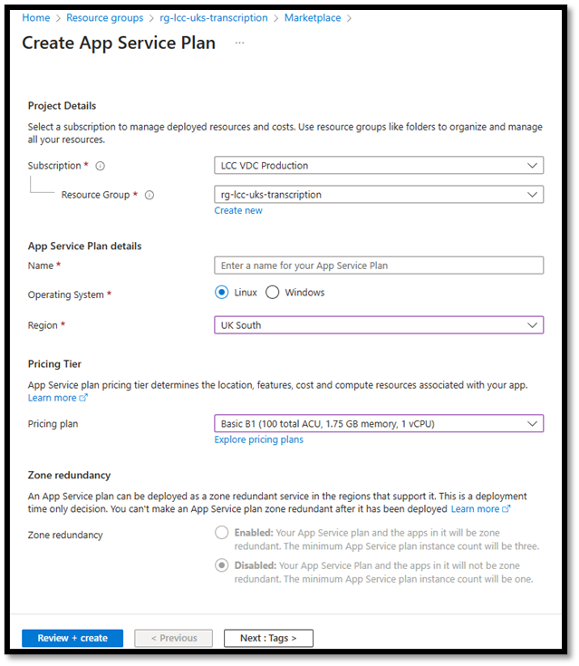


4. Add any Tags you may require, then review and create the resource.

## Creating a Static Web App

An Azure Static Web App is a service that lets you host websites that don’t change often. This is what hosts the front end that you use to interact with the solution.

1. In the Resource group, click “Create” on the top bar.
2. In the marketplace, search for “Static Web Apps.”
3. Click "Create" and enter the required information. Select your chosen ‘Hosting plan’ and deployment ‘Source’.


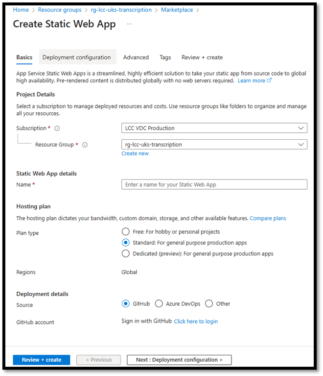

4. Provide a Name and select the Plan you want.
5. Choose your Deployment source and fill in the details as needed.
6. For ‘Build Presets’ choose next.js *(confirm this is the same with GitHub*)
7. Click on Next and setup your deployment config.
8. Click next, in the Advanced tab select the region.
9. Add any Tags you may require, then review and create the resource.

## Create Application Insights

Application Insights provides monitoring and tracking for the solution.

1. Click on "Create a resource" in the top left.
2. Search for "Application Insights" in the marketplace.
3. Click "Create" and fill in the required details, such as Subscription, Resource group, and Region. Select an existing Log Analytics Workspace of your choice or create a new one as part of this deployment.

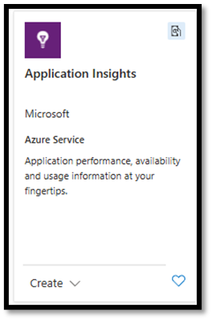


4. Add any Tags you may require, then review and create the resource.

## Creating a Web App

Web Apps allow you to create and host websites or web applications using various frameworks. This is assigned to the App Service Plan.

1. In the Resource group, click “Create” on the top bar.
2. In the marketplace, search for “Web App.”
3. Click "Create" and fill in the required details, such as Subscription, Resource group, and Region. Select the Runtime stack **Python 3.11**.


4. Select the name of the ‘App Service Plan’ created earlier as the Linux Plan.
5. Click next, setting up a Database is not required.
6. Click next, a Continuous deployment is not required. Basic authentication can be set to **‘Disable’**.
7. Click next, setup networking as required.
8. Click next, enable Application insights and select the Application Insights resource created previously (recommended).

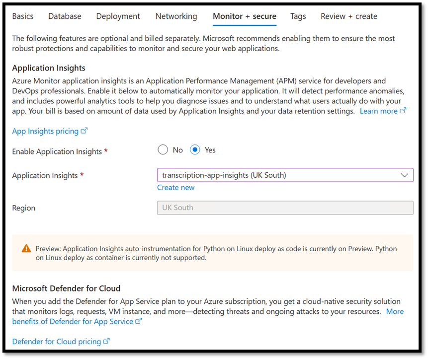

9. Add any Tags you may require, then review and create the resource.

## Creating a Storage Account

Storage accounts provided various means to store both structured and unstructured data. For this solution, Blob storage is used which is required to store the recordings, transcripts and the summary output.

1. In the Resource group, click “Create” on the top bar.
2. In the marketplace, search for “Storage account”


3. Click "Create" and fill in the required details, such as Subscription, Resource group, and Region.
4. Choose “**Azure blob Storage** or **Azure Data Lake Storage Gen 2**” as the Primary service.
5. For the Performance and Redundancy options, configure these as per your requirements.
6. Click next, configure Advanced, Networking, Data protection and Encryption as required – the current Microsoft default settings can work for this deployment.
7. Add any Tags you may require, then review and create the resource.

## Creating a Function App

Function Apps allow you to run event-driven code without managing infrastructure.

1. In the Resource group, click “Create” on the top bar.
2. In the marketplace, search for “Function App” and select the ‘App Service’ as the Hosting plan.

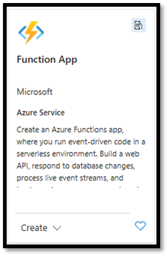
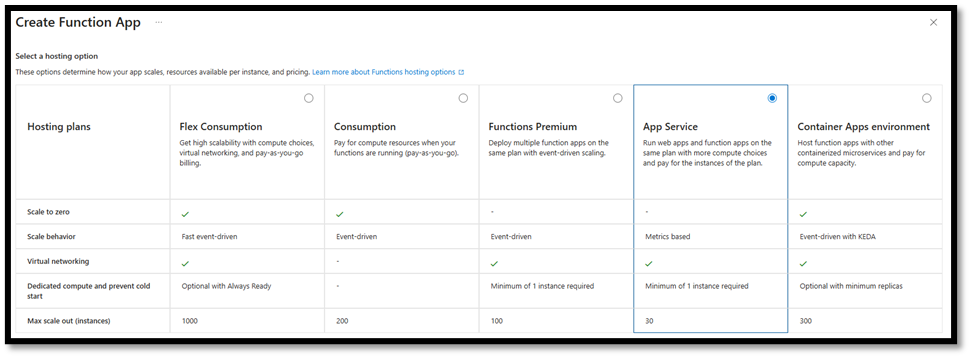

3. Click "Create" and fill in the required details, such as Subscription, Resource group, and Region.
   * Provide a unique Name, and for “Do you want to deploy code or container image?” select **Code**.
   * Select the Runtime stack as **Python** and Version as **3.11**.
   * For Linux Plan, select the app service plan you created earlier.


4. Click next, under Storage select the storage account you created earlier.
5. Click next, setup Networking configure this as required.
6. Click next, under Monitoring setup application insights using the one you created earlier. This will be helpful for debugging.
7. Click next, setup continuous deployment if needed but this is not required.
8. Add any Tags you may require, then review and create the resource.

## Creating a Cosmos DB

Cosmos DB provides globally distributed, multi-model database capabilities for your applications. This is used for the authentication, the prompts, and recording and tracking jobs.

1. In the Resource group, click “Create” on the top bar.
2. In the marketplace, search for “Azure Cosmos DB.” Click Create and then create the “Azure Cosmos DB for NoSQL”

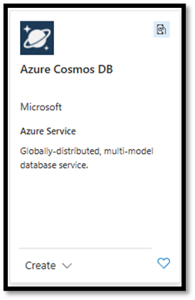
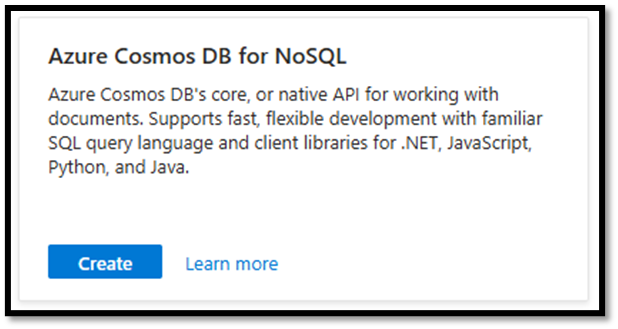


3. Click "Create" and fill in the required details, such as Subscription, Resource group, and Region. Choose the Capacity mode you require. 

4. Click next, configure Global distribution, Networking, and Backup Policy as you require.
5. Click next, under Encryption select **Service-Managed Keys**.
6. Add any Tags you may require, then review and create the resource.

## Deploying the Azure OpenAI Service

Azure OpenAI services is where you deploy an LLM model e.g. GPT4o-mini that will be used to integrate the transcription solution with.

1. In the Resource group, click “Create” on the top bar.
2. In the marketplace, search for “Azure OpenAI.”
3. Choose your Subscription, Resource group and Region. Set your chosen pricing tier.


4. Click next, configure Networking as you require.
5. Add any Tags you may require, then review and create the resource.

## Deploying the Speech Service

The Speech Service offers speech-to-text, text-to-speech, and speech translation capabilities. This is used to transcribe the recording only.

1. In the Resource group, click “Create” on the top bar.
2. In the marketplace, search for “Speech” and create the resource.
3. Choose your Subscription, Resource group, Region and select your preferred Pricing tier. *NB: The Free tier can be used for testing.*


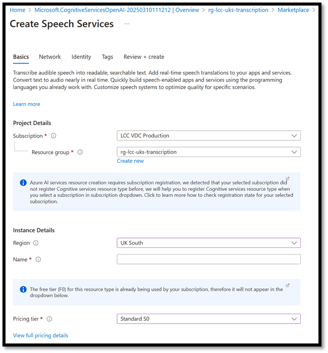

4. Click next, configure Networking as you require.
5. Click next, under Identity enable ** `System assigned identity` **.
6. Add any Tags you may require, then review and create the resource.

## Resource Permissions

System Assigned Managed Identity needs to be enabled for the following resources, which will allow resources created above to securely access each other where required:

* WebApp
* Cosmos
* Speech service
* Function App

### Function App Permissions

1. On the function app, in the left-hand menu, select `Identity` under the `Settings` section. Under the "System assigned" tab, switch the Status to "On" and save the changes. This action will create a managed identity for the Azure service.


2. Under `Azure role assignment` in the same location, click on `Azure role assignment`. Set the scope to storage, choose your subscription, choose your resource. Then set the roles
   * Storage Account Contributor
   * Storage Blob Data contributor
   * Storage Queue Data Contributor

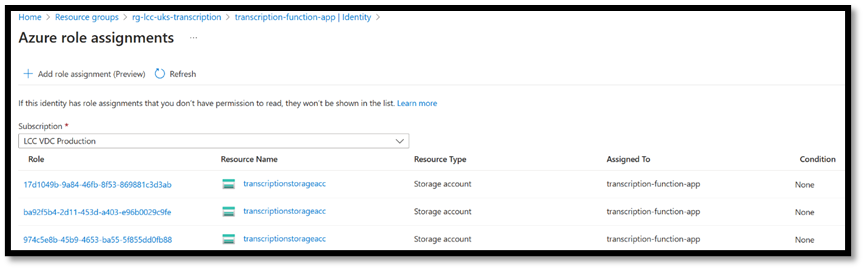

### WebApp Permissions

1. On the function app, in the left-hand menu, select `Identity` under the `Settings` section. Under the "System assigned" tab, switch the Status to "On" and save the changes. This action will create a managed identity for the Azure service.


2. Under ‘Azure role assignment’ in the same location, click on `Azure role assignment`. Set the scope to storage, choose your subscription, choose your resource. Then set the roles
   * Storage Account Contributor
   * Storage Blob Data Contributor
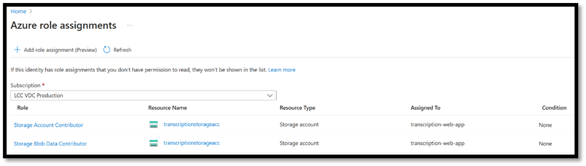

### Speech Service Permissions

1. On the Speech Service resource, navigate to `Access Control (IAM)`, click add, then `Add role Assignment`. Find the `Cognitive Services Speech Contributor` role and click it to highlight it then click next. Change `Assign access` to `Managed Identity` then click `Select members`, set “Managed identity” to “Function App” and find the function app you created earlier. Select it then click “select” and then click “review & assigned” twice.


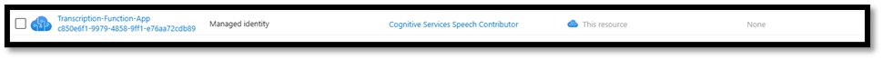


2. Under Resource Management, select Identity and then Azure role assignments. You will need to set scope to storage, choose your subscription, choose your resource. Then set the roles
   * Storage Account Contributor
   * Storage Blob Data Contributor

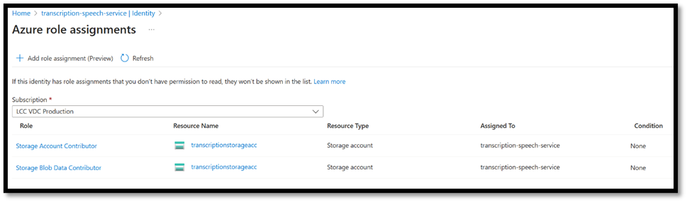

### Azure OpenAI Service Permissions

1. On the Azure OpenAI Service resource, navigate to Access Control (IAM), click add, then “Add role Assignment”. Find the “Cognitive Services Contributor” role and click it to highlight it then click next. Change “Assign access” to “Managed Identity” then click “Select members”, set “Managed identity” to “Function App” and find the function app you created earlier. Select it then click “select” and then click “review & assigned” twice.


2. Add another role in the same way for “Cognitive Services OpenAI Contributor” role.

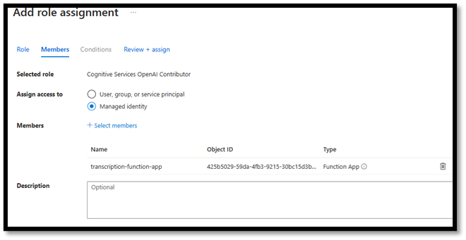

Once the permissions have been added, it should look like the following:


### Setting Additional Permissions via Azure CLI

The next set of permissions are set using the Azure CLI, to provision resource access to Cosmos. After applying these permissions via the Azure CLI, they will not appear in the Azure Portal. *NB: For tenants with newer Azure subscriptions, you may be able to set these permission sets using the Azure Portal GUI.*

#### Assign Data Reader Role to Azure Cosmos DB Account

1. Create the ‘Data Reader’ role on the Azure Cosmos DB Account. Use the file provided named ‘data\_reader\_role\_definition.json’.
2. Open Command Prompt, change directory to the location of the file you have saved above, and run the following command to create the role:

*az cosmosdb sql role definition create --account-name* ***<COSMOSAccount>*** *--resource-group* ***<ResourceGroup>*** *--body @data\_reader\_role\_definition.json*


3. Take note of the **name** value from the output.
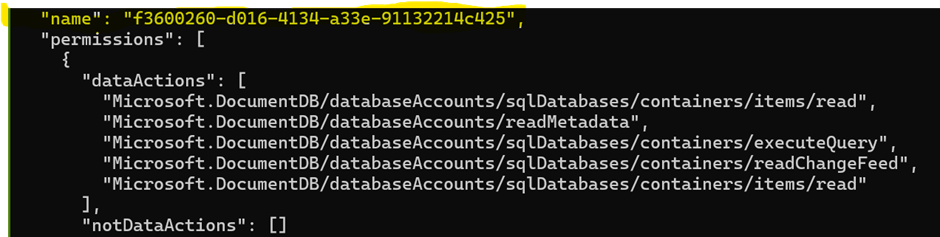
4. Run the following command to assign the **Data Reader** role to the function app.
5. az cosmosdb sql role assignment create --account-name **<cosmosaccountname>** --resource-group **<resourcegroupname>** --role-definition-id /subscriptions/**<subscriptionID>**/resourceGroups/**<resourcegroupname>**/providers/Microsoft.DocumentDB/databaseAccounts/**<cosmosaccountname>**/sqlRoleDefinitions/**<INSERT NAME VALUE>** --principal-id **<function app principle id>** --scope /subscriptions/**<subscriptionID>**/resourceGroups/**<resourcegroupname>**/providers/Microsoft.DocumentDB/databaseAccounts/**<cosmosaccountname>**

#### Assign Data Contributor Role to Azure Cosmos DB Account

1. Create the ‘Data Contributor role on the Azure Cosmos DB Account. Use the file provided named ‘data\_contributor\_role\_definition.json’.
2. Using Azure CLI, change directory to the location of the file you have saved above, and create the role and run the following command:

*az cosmosdb sql role definition create --account-name <COSMOSAccount> --resource-group <ResourceGroup> --body @data\_contributor\_role\_definition.json*

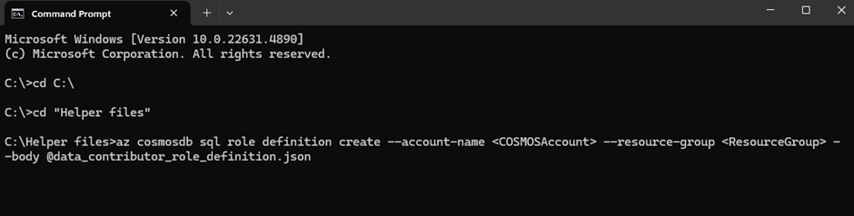

3. Take note of the **name** value from the output.


4. Run the following command to assign the **Data Contributor** role to the function app.

az cosmosdb sql role assignment create --account-name **<cosmosaccountname>** --resource-group **<resourcegroupname>** --role-definition-id /subscriptions/**<subscriptionID>**/resourceGroups/**<resourcegroupname>**/providers/Microsoft.DocumentDB/databaseAccounts/**<cosmosaccountname>**/sqlRoleDefinitions/**<INSERT NAME VALUE>** --principal-id **<function app principle id>** --scope /subscriptions/**<subscriptionID>**/resourceGroups/**<resourcegroupname>**/providers/Microsoft.DocumentDB/databaseAccounts/**<cosmosaccountname>**

#### Assign the Cosmos Data Reader & Contributor Roles to the WebApp

1. Run the following Azure CLI command to add Cosmos DB Data Contributor role.

*az cosmosdb sql role assignment create --resource-group* ***<*resourcegroupname*>*** *--account-name* ***<*cosmosaccountname*>*** *--role-definition-id "00000000-0000-0000-0000-000000000002" --principal-id* ***<web app Principle ID>*** *--scope "/subscriptions/****<subscriptionID>****/resourceGroups/****<*resourcegroupname*>****/providers/Microsoft.DocumentDB/databaseAccounts/****<*cosmosaccountname*>****"*

2. Run the following Azure CLI command to add Cosmos DB Data Reader role.

*az cosmosdb sql role assignment create --resource-group* ***<*resourcegroupname*>*** *--account-name* ***<*cosmosaccountname*>*** *--role-definition-id "00000000-0000-0000-0000-000000000001" --principal-id* ***<web app Principle ID>*** *--scope "/subscriptions/****<subscriptionID>****/resourceGroups/****<*resourcegroupname*>****/providers/Microsoft.DocumentDB/databaseAccounts/****<*cosmosaccountname*>****"*

## Configuring the Speech Service

On the Speech Service resource, go to Networking and create a custom domain. Enter a name for the domain name and click save.

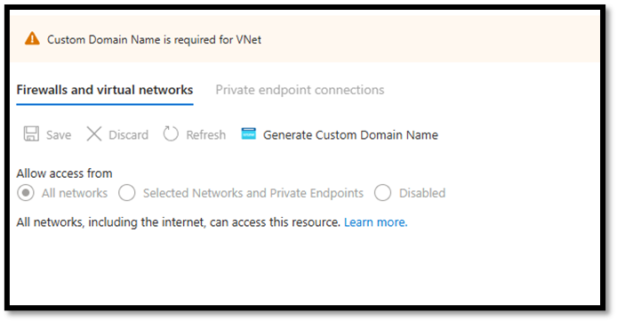

# Configuring the Azure OpenAI Service

This section covers the deployment of the Azure OpenAI GPT model that will be used.

1. Go to the Azure OpenAI resource and click on ‘Explore Azure AI Foundry portal’.

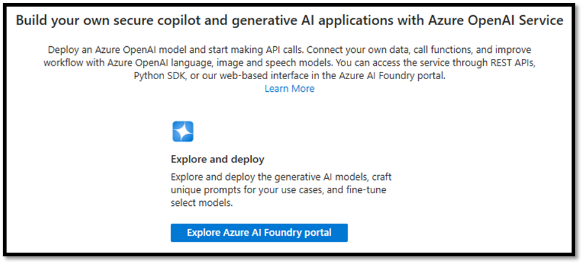

2. Under Deployments, click Deploy a model and then Deploy a Base Model. Select your chosen GPT model and click confirm. Select your preferred deployment options and click create resource and deploy.
3. Once created take note of the api version, which can be found at the end of the Target URL. This can be found under the endpoint heading. “https://<Servicename>.openai.azure.com/openai/deployments/<deployment>/chat/completions?api-version=2024-10-21”

*NB: When testing the content filters on the GPT deployment may affect your results. You may need to request access to change the inbuilt content filters from Microsoft directly, which can be configured in the Azure AI Foundry portal.*

# Configuring the Storage Account

1. Navigate to the storage account resource, under ‘containers’ add a new container for example ‘recordingcontainer’.


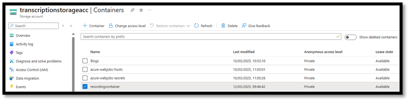

2. On the storage account, under ‘Settings’ select ‘Resource sharing (CORS)’, and set the following for the Blob service:

   * Allowed Origins set to \*
   * Allowed methods set to DELETE, GET and PUT
   * Allowed headers set to \*
   * Exposed headers set to \*
   * Max age set to 200

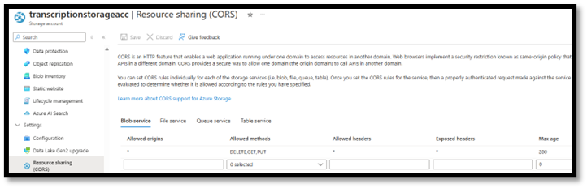

3. Save CORS settings

## Configuring the Azure Cosmos DB Account

### Creating a Database and Containers

1. Create a new Database within your Cosmos account e.g. “voice-transcription”. Navigate to “Data Explorer” click the arrow next to “New container” and then selected “New Database”.

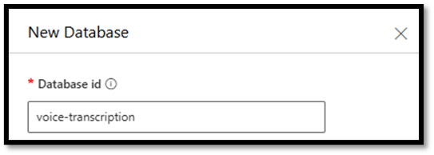

2. Create a voice\_auth container in the new database.
   * Database id – use existing and select the database created
   * Container id – voice\_auth
   * Partition key - /id
   * Unique keys - /email


3. Create a voice\_jobs container in the new database.
   * Database id – use existing and select the database created
   * Container id – voice\_jobs
   * Partition key - /id
   * Unique keys - /user\_id and /created\_at


4. Create a voice\_prompts container in the new database.
   * Database id – use existing and select the database created
   * Container id – voice\_prompts
   * Partition key - /id
   * Unique keys - /name

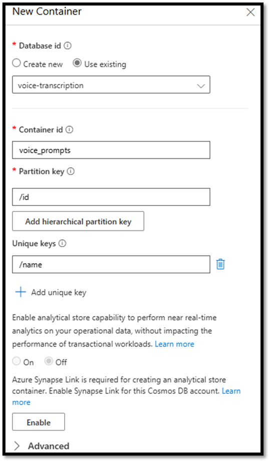

5. Create the indexing policy for the voice\_auth container. On this container, under settings, click ‘Indexing Policy’ and paste in the following code and click save.


```json
{
"indexingMode": "consistent",
"automatic": true,
"includedPaths": [
   {
   "path": "/email/?"
   },
   {
   "path": "/\*"
   }
],
"excludedPaths": [
   {
   "path": "/\_etag/?"
   }
],
   "fullTextIndexes": []
}
```

6. Create the indexing policy for the voice\_jobs container. On this container, under settings, click ‘Indexing Policy’ and paste in the following code and click save.

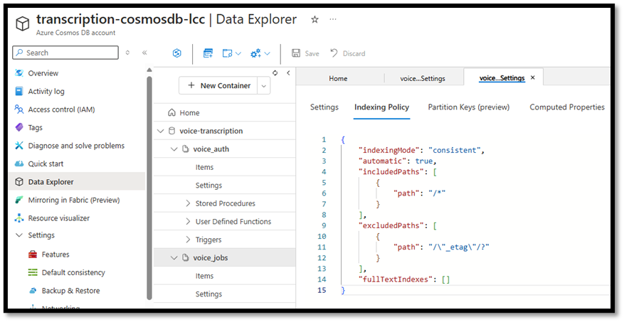
```json
{

    "indexingMode": "consistent",

    "automatic": true,

    "includedPaths": [

        {

            "path": "/user\_id/?"

        },

        {

            "path": "/prompt\_category\_id/?"

        },

        {

            "path": "/prompt\_subcategory\_id/?"

        },

        {

            "path": "/status/?"

        },

        {

            "path": "/created\_at/?"

        },

        {

            "path": "/\*"

        }

    ],

    "excludedPaths": [

        {

            "path": "/\_etag/?"

        }

    ],

    "fullTextIndexes": []

}
```
#### Creating Indexing Polices

7. Create the indexing policy for the voice\_prompts container. On this container, under settings, click ‘Indexing Policy’ and paste in the following code and click save.


```json
{

"indexingMode": "consistent",

"automatic": true,

"includedPaths": [

{

"path": "/type/?"

},

{

"path": "/category\_id/?"

},

{

"path": "/name/?"

},

{

"path": "/\*"

}

],

"excludedPaths": [

{

"path": "/\_etag/?"

}

],

"fullTextIndexes": []

}
```

# Configuring the WebApp

1. Open the file web-app-environmentvariables.txt and fill in the “Value” for each of the variables.
2. Navigate to environment variables and click “advanced edit”. Paste the variables from the file ‘web-app-environment-variables.txt’ at the end of the current variables. Ensure that you add a “,” after the last “}” as highlighted in the screenshot below before pasting the additional variables from the file.


3. Press ok and then apply.
4. Navigate to Configuration and add the following startup command, click save and then continue.
```sh
python3 -m gunicorn -w 2 -k uvicorn.workers.UvicornWorker app.main:app --bind 0.0.0.0:8000 --reload --log-level debug
```
5. Now Navigate to CORS, in Allowed Origins, add \* then click save.

## Configuring the Function App

1. Open the file function-app-environmentvariables.txt and fill in the “Value” for each of the variables.
2. Navigate to environment variables and click “advanced edit”. Paste the variables from the file ‘function-app-environment-variables.txt’ at the end of the current variables. Ensure that you add a “,” after the last “}” as highlighted in the screenshot below before pasting the additional variables from the file.


Note, the Azure\_Speech\_Deployment is the name of the custom endpoint chosen for the speech service defined earlier. You can find this on the speech service under Endpoint, found after https:// and before .cognitiveservices.

3. After adding the environment variables go to CORS in Allowed Origins, add \* then click save.

# Configuring & Deploying the Static Web App

1. Open the file apiConstants.ts (Found in \echo-brief\frontend\_app\lib)
2. Edit “export const BASE\_NAME =” to the base url of your webapp backend.
3. Open CMD and change directory to \echo-brief\frontend\_app
4. Run “npm install --legacy-peer-deps”
5. Then run “npm run build”

Access the Azure portal and navigate to your Static Web App service and copy the deployment token.


In the same command prompt run this command.
```sh
swa deploy ./out --env=production --deployment-token=**<deployment token>**
```

if you get “Failure Reason: Could not load StaticSitesClient metadata from remote. Please check your internet connection.” Your firewall may be blocking access to the Azure static Web app CLI.

# Deploying the Function App

**To deploy the Function App:**

1. Open CMD, Change directory to \echo-brief\az-func-audio and run this command to zip the function app.

**tar -a -c -f ../output.zip \***

2. then change directory to \echo-brief and then run this Azure CLI deployment command to deploy the Function App.

**az functionapp deployment source config-zip --subscription <subscriptionID>  --resource-group <resourcegroupname> --name <functionappname> --src output.zip --build-remote true**

3. Navigate to the Function app in the Azure Portal, on the overview page you should see the function “blob\_trigger”

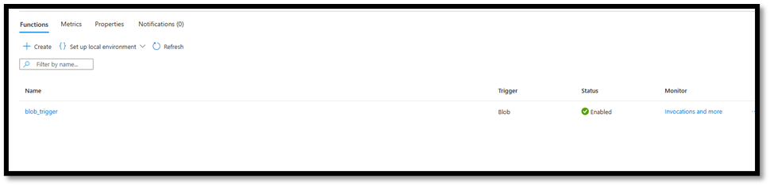

# Deploying the Backend App

1. Open Command prompt and change directory to \echo-brief\backend\_app and run this command to create a zip file.

**tar -a -c -f ../backend.zip app requirements.txt**

2. change directory to \echo-brief\ and then run the following command to deploy the backend code to the web app.

***az webapp deployment source config-zip --resource-group <resource-group-name> --name <web-app-name> --src backend.zip***

Once deployed you should get a site started successfully message.

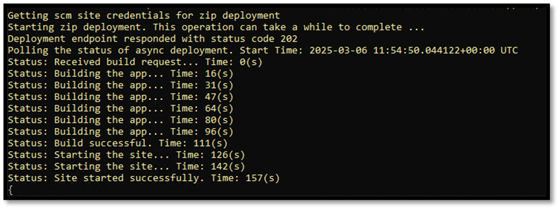

# Adding Prompts for Transcription Summary

1. Navigate to the transcription services frontend and register an account. This can be found on the overview page on the Static WebApp.


2. Edit the prompts.sh file downloaded as part of the repo. Fill in the details (backend url, username and password.) Right click an empty space in the folder where prompts.sh is and click “open git bash here”. Then run “./prompts.sh”.


> [!Note]
> Special thanks to Chris Masuda, David Willis, and Joe Broughton from Leicestershire County Council for preparing the manual deployment guidance.
